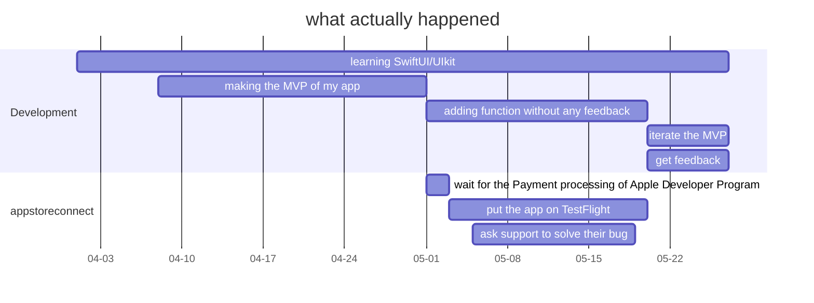

(Sorry, the graph used in this article is not readable in the dark mode. Please switch to light mode by clicking the button on the top right as needed.)

It's a mix of fun and pain for my first two months as an independent developer working on an iOS project. I will put on some graph to better explain it.

The Gantt graph below is what I expected. One month, app on the store.

- two weeks to learn iOS development and to build a minimum viable product (MVP)
- a week to iterate the product
- a week to go through the review process, to put the app on the store

And here is what actually happened. Two month, app only on the Testflight.

- constantly learning iOS development, because there is too much quirk in SwiftUI
- taking 20 days to build the MVP because "Share Extension" is a pain in the ass
- after building the MVP, have to wait 20 days to get feedbacks from users
- appstoreconnect blocks me from distribute the app for 2 weeks, Because of something that's not my fault

